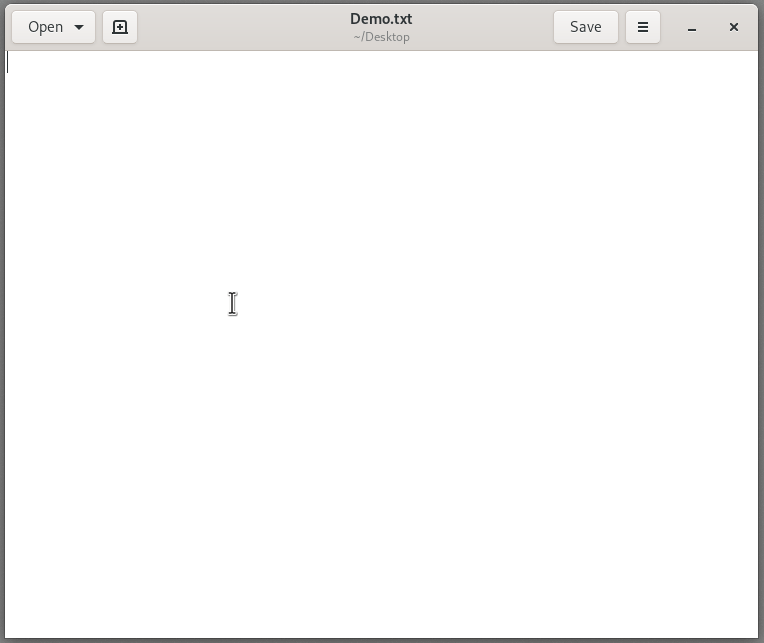

gedit-autoname
=============

`gedit-autoname` automatically names new files so you don't have to, replacing
[gedit](https://wiki.gnome.org/Apps/Gedit)'s "Untitled Document 1" with automatically generated filenames.



* When you open a new window or tab it'll open a file named
  `~/Desktop/Untitled YYYYMMDDHHMMSS.txt`,
  instead of the default behavior of opening an unnamed file and requiring you
  to pick a file name when you try to save it.

  You won't be asked for a filename when you save the file, it'll just save it to
  `~/Desktop/Untitled YYYYMMDDHHMMSS.txt`.

  You can still use <kbd>Save As…</kbd> if you want to rename the file yourself.

  Date and time suffixes are used so the filenames never conflict.

* Gedit's **autosaving** will be working immediately as soon as you open a new
  window or tab, so you'll never be at risk of losing any work (normally it
  doesn't start autosaving an untitled document until you've saved it once
  manually, and chosen a filename).

  You have to enable autosaving under <kbd>Preferences</kbd> → <kbd>Editor</kbd> → <kbd>File Saving</kbd>.
  Or better, install my [gedit-smart-autosave](https://github.com/seanh/gedit-smart-autosave/) plugin for
  faster autosaving.
  
* When you save a file it will be **renamed based on the first line** of the file.

  You end up with filenames like `~/Desktop/My Pancake Recipe YYYYMMDDHHMMSS.txt`,
  so you can tell what the contents of each file are from the filename.

  The title is derived from the first non-blank line of the file, truncated and
  with non-ASCII characters and extraneous whitespace removed. This works well
  with headings from markdown and similar markup languages, or simply with
  files that use the opening line as a title. If your file doesn't contain a
  title as such then the first line of text usually provides a reasonable
  preview of the contents.

  This enables a fast plain text note-taking flow: launch gedit
  (I have `gedit --new-window` bound to <kbd><kbd>Super</kbd> + <kbd>g</kbd></kbd>),
  type or paste in some notes, save the file (<kbd><kbd>Ctrl</kbd> + <kbd>s</kbd></kbd>),
  quit gedit (<kbd><kbd>Ctrl</kbd> + <kbd>q</kbd></kbd>). Each note will be
  saved with a sensible filename, and you never have to choose a filename
  yourself. No popup dialogs from gedit either.
  With [gedit-smart-autosave](https://github.com/seanh/gedit-smart-autosave/)
  you don't even need the <kbd><kbd>Ctrl</kbd> + <kbd>s</kbd></kbd>.

* If the file is empty when you save it, **the file will be deleted**.

  So you don't end up with empty `~/Desktop/Untitled YYYYMMDDHHMMSS.txt`
  files lying around.

  You can also cause the plugin to delete a file by opening it, deleting all
  its contents, saving, and closing the file.

* It will only rename and delete files that match the
  `~/Desktop/* YYYYMMDDHHMMSS.txt` pattern, so it won't touch files you've
  named yourself.


Installation
------------

```shellsession
$ mkdir -p ~/.local/share/gedit/plugins
$ git clone https://github.com/seanh/gedit-autoname.git ~/.local/share/gedit/plugins/gedit-autoname
```

Then in gedit go to <kbd>Preferences</kbd> → <kbd>Plugins</kbd> and enable the **Autoname** plugin.


TODO
----

- [ ] When creating a `~/Desktop/Untitled YYYYMMDDHHMMSS.txt`
  file it should check whether the file already exists and append ` 1`, ` 2`
  etc to the filename as necessary.

- [ ] The directory where new files are created (`~/Desktop`) should be configurable.
